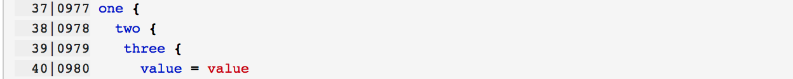
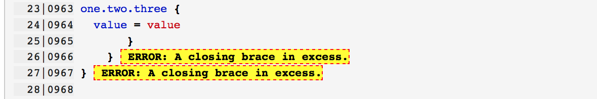
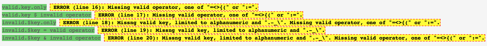
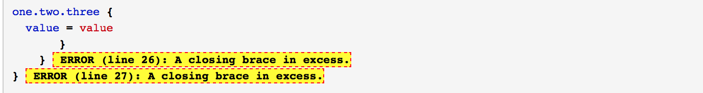
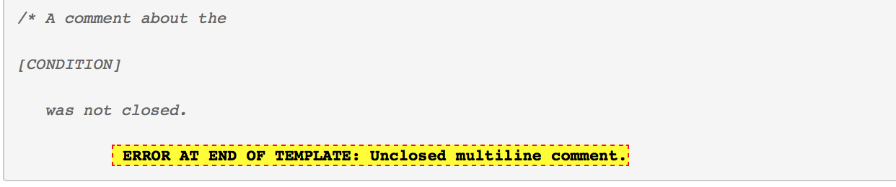
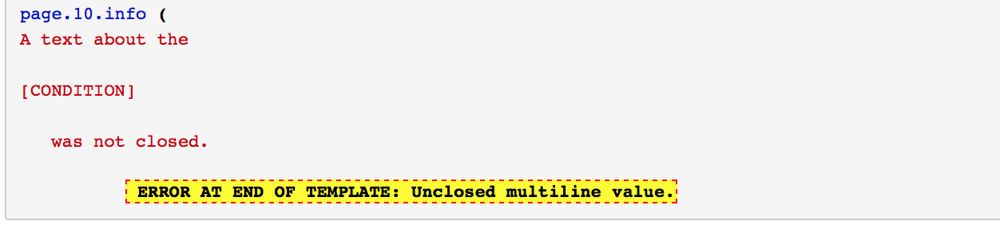

.. ==================================================
.. FOR YOUR INFORMATION
.. --------------------------------------------------
.. -*- coding: utf-8 -*- with BOM.

.. include:: Includes.txt

.. _screenshots:

===========
Screenshots
===========

Line numbering
==============

   The line numbers show the numbering of the template and the overall
   numbering within the template tree.

.. figure::  Images/ErrorsWithLineNumberingTurnedOff.png

   When line numbering is turned off the error messages contain the
   line number instead.

   When line numbering is turned on the error messages don't duplicate the
   information.

Types of errors
===============

   For invalid lines it is assumed that the user want's to enter an operator
   line. It is checked for invalid key and operator.

   Braces in access are shown in the line where they occur.

   Missing closing braces are detected at conditions and at the end of the
   template.

   An unclosed multiline comment is detected at the end of the template.
   Multiline comments can be used to comment out parts of the script. Included
   elements like conditions don't result in an error.

   An unclosed multiline value is detected at the end of the template.

